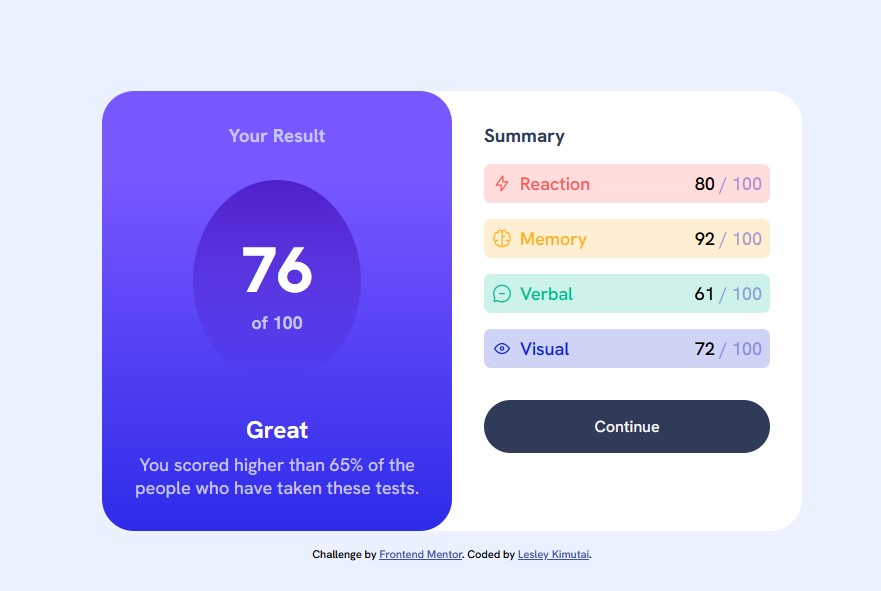

# Frontend Mentor - Results summary component solution

This is a solution to the [Results summary component challenge on Frontend Mentor](https://www.frontendmentor.io/challenges/results-summary-component-CE_K6s0maV). Frontend Mentor challenges help you improve your coding skills by building realistic projects. 

## Table of contents

- [Frontend Mentor - Results summary component solution](#frontend-mentor---results-summary-component-solution)
  - [Table of contents](#table-of-contents)
  - [Overview](#overview)
    - [The challenge](#the-challenge)
    - [Screenshot](#screenshot)
    - [Links](#links)
  - [My process](#my-process)
    - [Built with](#built-with)
    - [What I learned](#what-i-learned)
    - [Continued development](#continued-development)
  - [Author](#author)


## Overview

### The challenge

Users should be able to:

- View the optimal layout for the interface depending on their device's screen size
- See hover and focus states for all interactive elements on the page

### Screenshot

- Result summary mockup screenshot



### Links

- Solution URL: [Github Link](https://github.com/issagoodlifeInc/result-summary.git)
- Live Site URL: [Result Summary](https://result-sumary.netlify.app/)

## My process

### Built with

- Semantic HTML5 markup
- CSS custom properties
- Flexbox
- CSS Grid
- Mobile-first workflow

### What I learned


Styling the `.score` by using `:nth-child()` selector

```css

/* Styling all the scores --- className in js brought this issue but fixed it by changing to class */
.scores > * {
  display: flex;
  padding: 0.5rem;
  gap: 0.5rem;
}

/* Using the nth child selector to color the summary type */
.score:nth-child(2) .score_category {
  color: var(--orangeyyellow);
}

.score:nth-child(3) .score_category {
  color: var(--greenteal);
}
```

Added the score data + icons + totlaa score with js
```js
fetch("../data.json")
  .then((response) => response.json())
  .then((data) => {
    // Empty score array to add the scores when maping through the data
    let scoreArr = [];
    data.map((score) => {
      scoresDiv.innerHTML += `
            <div className="score">
            
            <p className="score_category">${score.category}</p>
            <p className="score_goten">${score.score}<span> / 100<span><p>
            </div>
            `;
      scoreArr.push(score.score);
    });
    // Calculated the average by using the reduce method then rounding the average after dividing by the length
    const average = Math.round(
      scoreArr.reduce((acc, currentVal) => acc + currentVal) / scoreArr.length
    );
    // Rendering the total value
    total.innerHTML += `${average}<span>of 100</span>`;
  });

```

### Continued development

Always my turnaround time can be a tad quicker

## Author

- Frontend Mentor - [@Leskim](https://www.frontendmentor.io/profile/Leskim)

